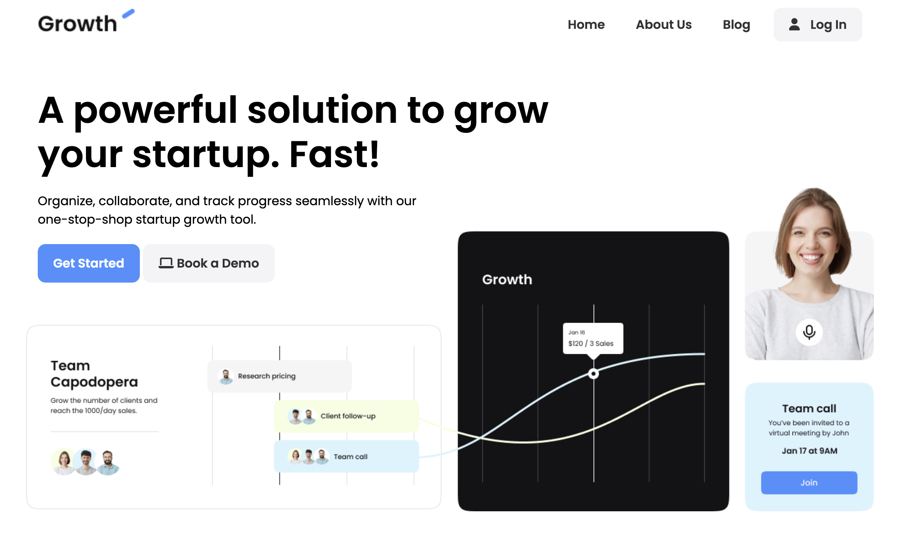

# Growth App - SaaS Landing Page

A modern and responsive SaaS landing page designed to showcase the features, benefits, and pricing of a startup growth tool. This project is perfect for promoting SaaS products and engaging potential customers with a professional and visually appealing design.

## Features

- **Hero Section**: Captivating headline and call-to-action buttons to grab user attention.
- **Video Section**: Demonstrates the product's functionality with a video preview.
- **Testimonials**: Highlights success stories from satisfied customers.
- **Pricing Plans**: Displays clear and transparent pricing options with detailed features.
- **FAQ Section**: Answers common questions to address customer concerns.
- **Newsletter Subscription**: Allows users to subscribe for updates and tips.
- **Responsive Design**: Fully optimized for desktop, tablet, and mobile devices.
- **Social Media Integration**: Includes links to social platforms for easy sharing.

## Technologies Used

- HTML
- CSS
- JavaScript
- Font Awesome for icons
- Google Fonts for typography

## How to Use

- Clone the repository.
- Open index.html in your browser.
- Explore the landing page to see its features and design.
- Customize the content, styles, and scripts to fit your SaaS product.
